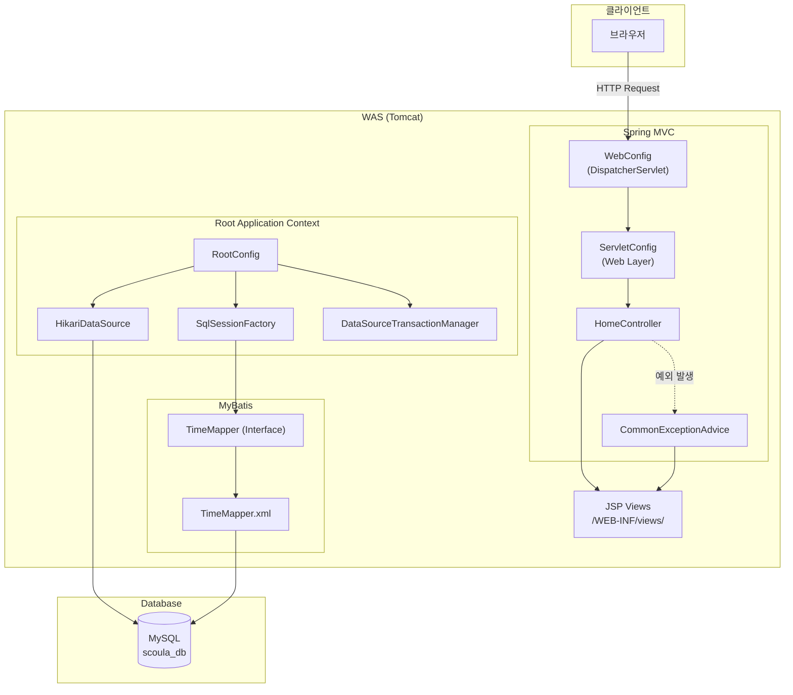
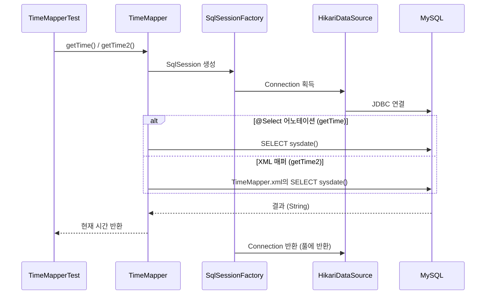
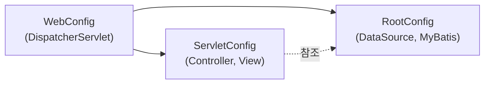

# ex04 — Spring MVC + MyBatis

Spring Framework 기반의 웹 애플리케이션으로, **HikariCP** 커넥션 풀과 **MyBatis**를 이용해 MySQL 데이터베이스에 접근하는 실습 프로젝트입니다.

---

## 목차

- [기술 스택](#기술-스택)
- [시스템 아키텍처](#시스템-아키텍처)
- [MyBatis 동작 흐름](#mybatis-동작-흐름)
- [프로젝트 구조](#프로젝트-구조)
- [환경 설정](#환경-설정)
- [실행 방법](#실행-방법)
- [테스트](#테스트)
- [엔드포인트](#엔드포인트)
- [주요 설정 파일](#주요-설정-파일)

---

## 기술 스택

| 구분 | 기술 | 버전 |
|------|------|------|
| Language | Java | 17 |
| Build Tool | Gradle | — |
| Framework | Spring Context / WebMVC | 5.3.37 |
| ORM | MyBatis | 3.4.6 |
| MyBatis-Spring | mybatis-spring | 1.3.2 |
| Database | MySQL | 8.x |
| Connection Pool | HikariCP | 2.7.4 |
| View | JSP + JSTL | — |
| Logging | Log4j2 | 2.18.0 |
| Test | JUnit 5 | 5.9.2 |
| Utility | Lombok | 1.18.30 |

---

## 시스템 아키텍처



---

## MyBatis 동작 흐름



### MyBatis SQL 매핑 방식 비교

| 방식 | 메서드 | SQL 정의 위치 | 설명 |
|------|--------|---------------|------|
| 어노테이션 | `getTime()` | `@Select` 어노테이션 | 간단한 쿼리에 적합 |
| XML | `getTime2()` | `TimeMapper.xml` | 복잡한 SQL, 동적 쿼리에 적합 |

---

## 프로젝트 구조

```
ex04/
├── build.gradle                          # Gradle 빌드 설정
├── settings.gradle
├── src/
│   ├── main/
│   │   ├── java/org/scoula/
│   │   │   ├── config/
│   │   │   │   ├── RootConfig.java       # Root Context (DB, MyBatis)
│   │   │   │   ├── ServletConfig.java    # Web MVC 설정
│   │   │   │   └── WebConfig.java        # DispatcherServlet 초기화
│   │   │   ├── controller/
│   │   │   │   └── HomeController.java   # 홈 페이지 컨트롤러
│   │   │   ├── exception/
│   │   │   │   └── CommonExceptionAdvice.java
│   │   │   ├── mapper/
│   │   │   │   └── TimeMapper.java       # MyBatis Mapper 인터페이스
│   │   │   └── ex01/
│   │   │       └── HelloServlet.java     # 서블릿 예제
│   │   ├── resources/
│   │   │   ├── application.properties    # DB 접속 정보
│   │   │   ├── mybatis-config.xml
│   │   │   └── org/scoula/mapper/
│   │   │       └── TimeMapper.xml
│   │   └── webapp/
│   │       └── WEB-INF/views/            # JSP 뷰
│   └── test/java/org/scoula/
│       ├── config/RootConfigTest.java    # HikariCP 연결 테스트
│       ├── mapper/TimeMapperTest.java    # MyBatis Mapper 테스트
│       └── persistence/JDBCTests.java    # 순수 JDBC 연결 테스트
```

---

## 환경 설정

### 사전 요구사항

| 항목 | 요구 사항 |
|------|-----------|
| JDK | 17 이상 |
| MySQL | 8.x |
| WAS | Tomcat 9+ (Servlet 4.0) |
| IDE | IntelliJ IDEA (권장) |

### 데이터베이스 설정

`src/main/resources/application.properties` 파일에서 DB 접속 정보를 확인·수정합니다.

| 속성 | 기본값 | 설명 |
|------|--------|------|
| `jdbc.driver` | `com.mysql.cj.jdbc.Driver` | JDBC 드라이버 |
| `jdbc.url` | `jdbc:mysql://127.0.0.1:3306/scoula_db` | DB URL |
| `jdbc.username` | `scoula` | DB 사용자 |
| `jdbc.password` | `1234` | DB 비밀번호 |

MySQL에서 데이터베이스와 사용자를 미리 생성해야 합니다.

```sql
CREATE DATABASE scoula_db CHARACTER SET utf8mb4 COLLATE utf8mb4_unicode_ci;
CREATE USER 'scoula'@'localhost' IDENTIFIED BY '1234';
GRANT ALL PRIVILEGES ON scoula_db.* TO 'scoula'@'localhost';
FLUSH PRIVILEGES;
```

---

## 실행 방법

### 1. 프로젝트 빌드

```bash
# Windows
gradlew.bat build

# macOS / Linux
./gradlew build
```

### 2. WAR 배포

빌드된 WAR 파일을 Tomcat의 `webapps` 디렉터리에 배포하거나, IDE에서 Tomcat 서버에 프로젝트를 추가하여 실행합니다.

### 3. Spring Context 계층 구조



| Context | 설정 클래스 | 역할 |
|---------|-------------|------|
| Root | `RootConfig` | DataSource, SqlSessionFactory, TransactionManager |
| Servlet | `ServletConfig` | Controller, ViewResolver, ResourceHandler |

---

## 테스트

```bash
# 전체 테스트 실행
gradlew.bat test

# 특정 테스트 클래스만 실행
gradlew.bat test --tests org.scoula.mapper.TimeMapperTest
```

| 테스트 클래스 | 검증 내용 |
|---------------|-----------|
| `JDBCTests` | 순수 JDBC로 MySQL 연결 확인 |
| `RootConfigTest` | HikariCP DataSource Bean 연결 확인 |
| `TimeMapperTest` | MyBatis `@Select` / XML 매퍼 동작 확인 |

> **참고:** DB 연결 테스트는 MySQL 서버가 실행 중이어야 통과합니다.

---

## 엔드포인트

| HTTP Method | URL | 처리 클래스 | 설명 |
|-------------|-----|-------------|------|
| GET | `/` | `HomeController` | 홈 페이지 (`home.jsp`) |
| GET | `/hello-servlet` | `HelloServlet` | 서블릿 Hello World 예제 |
| — | `/resources/**` | 정적 리소스 | CSS, JS, 이미지 등 |

---

## 주요 설정 파일

| 파일 | 설명 |
|------|------|
| `WebConfig.java` | DispatcherServlet 매핑 (`/`), UTF-8 필터, 파일 업로드 설정 |
| `RootConfig.java` | HikariCP, MyBatis SqlSessionFactory, `@MapperScan` |
| `ServletConfig.java` | ViewResolver (JSP), 정적 리소스 핸들러 |
| `application.properties` | JDBC 접속 정보 |
| `mybatis-config.xml` | MyBatis 전역 설정 |
| `TimeMapper.xml` | SQL 매퍼 XML |

---

## 라이선스

교육용 실습 프로젝트 (org.scoula)
